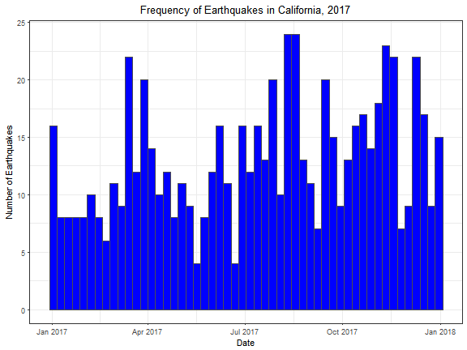
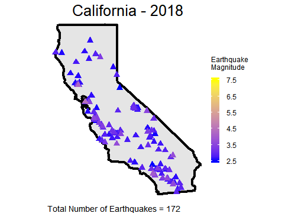
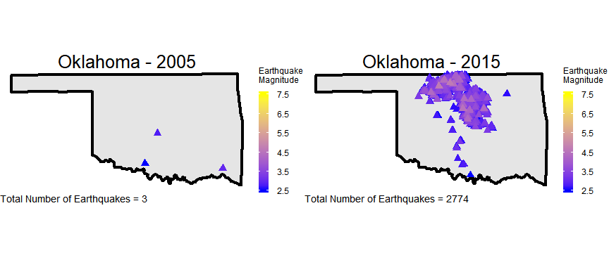

ShinyApp Pitch
========================================================
author: C. McBride      
date: April 4, 2018
autosize: true

Earthquakes
========================================================

Earthquakes are an extraordinarily frequent occurence, although few of them are strong enough to be felt nevermind cause significant damage. 

Exploring Earthquakes by State
========================================================

Wouldn't it be valuable to have an application that would allow you to explore the frequency and geographic distribution of earthquakes by state? The earthquake mapping app allows you to select a particular state to map the quake data to.

View Across Time
========================================================

The application also gives the user the power to look at trends in quakes across time. For example, the reported increase in earthquakes associated with the rapid spread of hydrolic fracturing gas and petroleum extraction (fracking) in Oklahoma can be clearly illustrated.

Explore the EarthQuakeMapper App
========================================================

Take the time to explore everything the app has to offer and learn more about the frequency and distributions of earthquakes.

### [Launch EarthQuakeMapper](http://connermcb.shinyapps.io/quakes_shiny_app)
